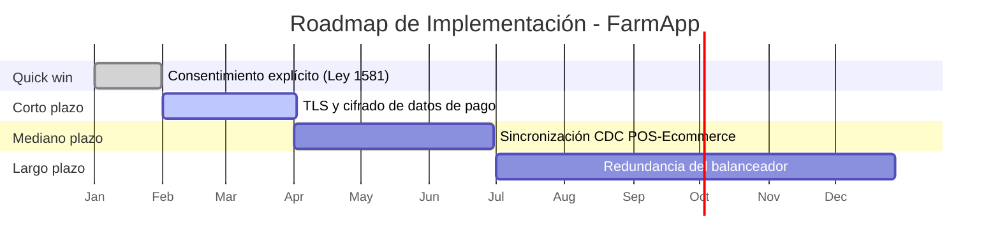

# 🧭 Guía Paso a Paso: Simulación de Comité de Arquitectura

Esta guía complementa el `README.md` del taller. A diferencia de los talleres anteriores, aquí no se construye una vista nueva ni se usa un caso base de clase: se toma **todo** el trabajo hecho para el cliente real (Talleres 1 a 8) y se condensa en una presentación ejecutiva de máximo 10 minutos, defendible ante un panel.

---

## 1. De dónde sale cada parte de la narrativa

La presentación se organiza en 4 actos. Cada uno se alimenta de talleres específicos — no se inventa contenido nuevo, se selecciona y se resume lo ya construido. El cuarto acto existe porque una solución sin plan de implementación deja al cliente con la misma pregunta sin responder: "¿y ahora cómo lo hago?".

| Acto | Pregunta que responde | Se alimenta de |
|---|---|---|
| 1. Problema | ¿Qué necesita el cliente y por qué es urgente? | Taller 1 (proceso actual), Taller 2 (contexto de negocio) |
| 2. Análisis | ¿Cómo está hoy la arquitectura y qué riesgos tiene? | Taller 3 (C1/C2), Taller 4 (infraestructura), Taller 5 (STRIDE), Taller 6 (normatividad) |
| 3. Solución | ¿Qué se propone y por qué es la mejor alternativa? | Taller 7 (Opportunities & Solutions: TO-BE y brechas), Taller 8 (integración de vistas) |
| 4. Plan de Implementación | ¿Cómo y en qué orden se llega de lo actual a lo propuesto? | Riesgos priorizados (Paso 3 de esta guía) + Solución (Acto 3) |

---

## 2. Metodología en 6 pasos

1. **Estructurar la narrativa** — organice todo el trabajo del curso en la historia de 4 actos: problema → análisis → solución → plan de implementación.
2. **Seleccionar la evidencia clave por acto** — de cada vista ya construida, elija solo lo que sostiene ese punto de la narrativa; en 10 minutos no cabe todo.
3. **Construir la matriz de riesgos arquitectónicos** — consolide (no repita desde cero) los riesgos ya identificados en Infraestructura, STRIDE y Normatividad, priorizados en una sola matriz ejecutiva.
4. **Construir el plan de implementación** — traduzca la solución (Acto 3) en fases ejecutables (quick win, corto, mediano y largo plazo), cada una trazable a un riesgo o brecha específico del Paso 3, con esfuerzo, duración y responsable sugerido.
5. **Preparar la defensa** — anticipe las preguntas más probables del panel (incluyendo sobre la viabilidad del plan de implementación) y prepare una respuesta basada en evidencia del curso, no en opinión.
6. **Ensayar contra el tiempo y ajustar** — practique la presentación completa cronometrada y recorte contenido (no velocidad de habla) hasta que quepa en el tiempo asignado.

---

## 3. Ejemplo guiado: Defensa de la solución de FarmApp

Continuando el ejemplo del Taller 7 (el hilo de negocio "Compra Online" de FarmApp), así se vería la síntesis para el comité.

### Paso 1 — Estructurar la narrativa

- **Acto 1 — Problema:** "FarmApp pierde ventas cuando el inventario del canal digital no refleja el inventario real de las tiendas físicas, generando pedidos que no se pueden despachar."
- **Acto 2 — Análisis:** "La arquitectura actual sincroniza el inventario entre el POS y la Plataforma E-commerce a través de la Base de Datos Replicada con varias horas de retraso; en horas pico, ese retraso es la causa raíz de los pedidos fallidos."
- **Acto 3 — Solución:** "Se propone sincronización casi en tiempo real (captura de cambios) entre el POS y la plataforma e-commerce, priorizada sobre alternativas más costosas por su menor impacto en el sistema heredado."
- **Acto 4 — Plan de Implementación:** "La solución se ejecuta en 4 fases, empezando por el ajuste de consentimiento legal (bajo esfuerzo, corrige una brecha de cumplimiento) y terminando por la redundancia del balanceador (mayor esfuerzo, menor probabilidad de ocurrencia)."

### Paso 2 — Seleccionar la evidencia clave por acto

| Acto | Vista de origen | Qué mostrar (un solo elemento, no todo el taller) |
|---|---|---|
| Problema | Vista de negocio (Taller 1 / 7) | El proceso "Compra Online" con el punto de falla resaltado |
| Análisis | Vista de infraestructura (Taller 4 / 7) | El mapa con el componente de sincronización marcado como cuello de botella |
| Solución | Tablero integrado (Taller 8) | La nueva conexión propuesta entre POS y la plataforma e-commerce |
| Plan de Implementación | Matriz de riesgos (Paso 3) | El roadmap de fases con su línea de tiempo (Paso 4) |

### Paso 3 — Construir la matriz de riesgos arquitectónicos

| Riesgo | Origen | Probabilidad | Impacto | Prioridad |
|---|---|---|---|---|
| Retraso de sincronización de inventario | Taller 4 (infraestructura) | Alta | Alto | 1 |
| Exposición de datos de pago | Taller 5 (STRIDE) | Media | Alto | 2 |
| Incumplimiento de la Ley 1581 en el manejo de datos de clientes | Taller 6 (normatividad) | Media | Alto | 2 |
| Punto único de falla en el balanceador de carga | Taller 4 (infraestructura) | Baja | Alto | 3 |

### Paso 4 — Construir el plan de implementación

Se traducen los 4 riesgos del Paso 3 en fases ejecutables. El orden no sigue la columna "Prioridad" al pie de la letra: el riesgo de mayor prioridad (retraso de sincronización) exige más esfuerzo de desarrollo, así que no es el quick win — se cruza prioridad de riesgo con esfuerzo de implementación.

| Fase | Qué se implementa | Riesgo que corrige | Esfuerzo | Duración | Responsable sugerido |
|---|---|---|---|---|---|
| Quick win | Consentimiento explícito antes de procesar datos de pago | Incumplimiento Ley 1581 | Bajo | 0–1 mes | Producto / Legal |
| Corto plazo | TLS en todos los subdominios y cifrado de datos de pago en tránsito | Exposición de datos de pago (STRIDE) | Medio | 1–3 meses | Seguridad |
| Mediano plazo | Sincronización casi en tiempo real (CDC) entre POS y e-commerce | Retraso de sincronización de inventario | Alto | 3–6 meses | Plataforma |
| Largo plazo | Redundancia del balanceador de carga | Punto único de falla | Medio | 6–12 meses | Infraestructura |

### Paso 5 — Preparar la defensa

| Pregunta probable del panel | Respuesta basada en evidencia |
|---|---|
| "¿Por qué no migraron todo a la nube pública en vez de mantener la nube híbrida?" | "El Taller 4 identificó que los servidores regionales ya cumplen el SLA de latencia local; migrar todo implicaría reescribir el sistema POS heredado sin un beneficio claro a corto plazo." |
| "¿Cómo garantizan el cumplimiento de la Ley 1581 con el nuevo flujo de datos?" | "El Taller 6 identificó la brecha de consentimiento explícito; por eso es el quick win del plan de implementación, no algo pospuesto para el año siguiente." |
| "¿Por qué la corrección del mayor riesgo (sincronización de inventario) no es lo primero que hacen?" | "Es la fase de mayor esfuerzo de desarrollo; empezar por los quick wins de bajo esfuerzo genera confianza y resultados visibles mientras se prepara la fase más compleja." |

### Paso 6 — Ensayar contra el tiempo

| Sección | Tiempo objetivo |
|---|---|
| Acto 1 — Problema | 2 min |
| Acto 2 — Análisis | 2 min |
| Acto 3 — Solución | 2 min |
| Acto 4 — Plan de Implementación | 2 min |
| Cierre y transición a preguntas | 2 min |
| **Total** | **10 min** |

---

## 4. Errores comunes a evitar

| Error frecuente | Por qué es un problema | Cómo corregirlo |
|---|---|---|
| Mostrar todos los diagramas de los 8 talleres en la presentación | Se pierde el tiempo asignado en detalle irrelevante para el panel | Seleccione solo la evidencia que sostiene cada acto (Paso 2) |
| Matriz de riesgos hecha desde cero, sin relación con los hallazgos previos | Contradice o repite trabajo ya hecho en el curso | Consolide los riesgos ya identificados en los Talleres 4, 5 y 6 |
| Proponer una solución sin plan de implementación | El cliente se queda con el mismo "¿y ahora cómo lo hago?" que tenía antes del curso | Traduzca la solución en fases con esfuerzo, duración y responsable (Paso 4) |
| Ordenar las fases del plan solo por prioridad de riesgo | Un riesgo de alta prioridad pero alto esfuerzo no siempre debe ir primero | Cruce prioridad de riesgo con esfuerzo de implementación al secuenciar las fases |
| No practicar la defensa de preguntas difíciles | El equipo improvisa respuestas débiles frente al panel | Anticipe preguntas críticas y prepare respuestas basadas en evidencia (Paso 5) |
| Presentación sin cronometrar | Se corta a mitad de la solución por exceso de tiempo | Ensaye con cronómetro y ajuste el contenido, no la velocidad al hablar |

---

## 5. Checklist de autoevaluación antes de entregar

- [ ] La narrativa sigue la estructura problema → análisis → solución → plan de implementación.
- [ ] Cada acto muestra solo la evidencia esencial de las vistas ya construidas, no todos los diagramas.
- [ ] La matriz de riesgos consolida los hallazgos de Infraestructura, STRIDE y Normatividad.
- [ ] Existe un plan de implementación con fases (quick win, corto, mediano y largo plazo), cada una trazada a un riesgo o brecha específico.
- [ ] El orden de las fases considera tanto el riesgo como el esfuerzo de implementación, no solo la prioridad de riesgo.
- [ ] Se prepararon respuestas basadas en evidencia para al menos 3 preguntas críticas probables.
- [ ] La presentación fue ensayada y cabe en el tiempo asignado (máximo 10 minutos).
- [ ] Cada integrante tiene claro qué parte presenta y puede responder preguntas sobre ella.

---

_Esta guía hace parte del Taller 9 de Simulación de Comité de Arquitectura — curso Arquitectura Empresarial, Universidad de La Sabana._
