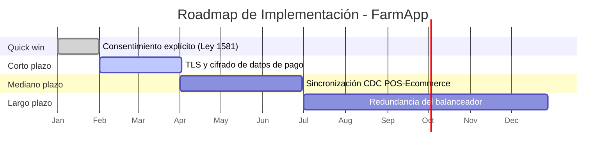
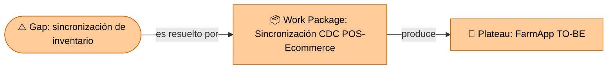

# 🧭 Guía Paso a Paso: Simulación de Comité de Arquitectura

Esta guía complementa el `README.md` del taller. A diferencia de los talleres anteriores, aquí no se construye una vista nueva ni se usa un caso base de clase: se toma **todo** el trabajo hecho para el cliente real (Talleres 1 a 8) y se condensa en una presentación ejecutiva de máximo 10 minutos, defendible ante un panel.

---

## 1. De dónde sale cada parte de la narrativa

La presentación se organiza en 4 actos. Cada uno se alimenta de talleres específicos — no se inventa contenido nuevo, se selecciona y se resume lo ya construido. El cuarto acto existe porque una solución sin plan de implementación deja al cliente con la misma pregunta sin responder: "¿y ahora cómo lo hago?".

| Acto | Pregunta que responde | Se alimenta de |
|---|---|---|
| 1. Problema | ¿Qué necesita el cliente y por qué es urgente? | Taller 1 (proceso actual), Taller 2 (contexto de negocio) |
| 2. Análisis | ¿Cómo está hoy la arquitectura y qué riesgos tiene? | Taller 3 (C1/C2), Taller 4 (infraestructura), Taller 5 (STRIDE), Taller 6 (normatividad) |
| 3. Solución | ¿Qué se propone y por qué es la mejor alternativa? | Taller 7 (Opportunities & Solutions: TO-BE y brechas), Taller 8 (integración de vistas) |
| 4. Plan de Implementación | ¿Cómo y en qué orden se llega de lo actual a lo propuesto? | Riesgos priorizados (Paso 3 de esta guía) + Solución (Acto 3) |

---

## 2. Metodología en 6 pasos

1. **Estructurar la narrativa** — organice todo el trabajo del curso en la historia de 4 actos: problema → análisis → solución → plan de implementación.
2. **Seleccionar la evidencia clave por acto** — de cada vista ya construida, elija solo lo que sostiene ese punto de la narrativa; en 10 minutos no cabe todo.
3. **Construir la matriz de riesgos arquitectónicos** — consolide (no repita desde cero) los riesgos ya identificados en el curso (Infraestructura, STRIDE/Seguridad, Normatividad) y complételos con los dominios que un análisis puramente técnico suele dejar por fuera (Negocio, Procesos, Datos, Gobierno TI), siguiendo los 7 dominios de riesgo de arquitectura empresarial, priorizados en una sola matriz ejecutiva.
4. **Construir el plan de implementación** — traduzca la solución (Acto 3) en fases ejecutables (quick win, corto, mediano y largo plazo), cada una trazable a un riesgo o brecha específico del Paso 3, con esfuerzo, duración y responsable sugerido.
5. **Preparar la defensa** — anticipe las preguntas más probables del panel (incluyendo sobre la viabilidad del plan de implementación) y prepare una respuesta basada en evidencia del curso, no en opinión.
6. **Ensayar contra el tiempo y ajustar** — practique la presentación completa cronometrada y recorte contenido (no velocidad de habla) hasta que quepa en el tiempo asignado.

---

## 3. Ejemplo guiado: Defensa de la solución de FarmApp

Continuando el ejemplo del Taller 7 (el hilo de negocio "Compra Online" de FarmApp), así se vería la síntesis para el comité.

### Paso 1 — Estructurar la narrativa

- **Acto 1 — Problema:** "FarmApp pierde ventas cuando el inventario del canal digital no refleja el inventario real de las tiendas físicas, generando pedidos que no se pueden despachar."
- **Acto 2 — Análisis:** "La arquitectura actual sincroniza el inventario entre el POS y la Plataforma E-commerce a través de la Base de Datos Replicada con varias horas de retraso; en horas pico, ese retraso es la causa raíz de los pedidos fallidos."
- **Acto 3 — Solución:** "Se propone sincronización casi en tiempo real (captura de cambios) entre el POS y la plataforma e-commerce, priorizada sobre alternativas más costosas por su menor impacto en el sistema heredado."
- **Acto 4 — Plan de Implementación:** "La solución se ejecuta en 4 fases, empezando por el ajuste de consentimiento legal (bajo esfuerzo, corrige una brecha de cumplimiento) y terminando por la redundancia del balanceador (mayor esfuerzo, menor probabilidad de ocurrencia)."

### Paso 2 — Seleccionar la evidencia clave por acto

| Acto | Vista de origen | Qué mostrar (un solo elemento, no todo el taller) |
|---|---|---|
| Problema | Vista de negocio (Taller 1 / 7) | El proceso "Compra Online" con el punto de falla resaltado |
| Análisis | Vista de infraestructura (Taller 4 / 7) | El mapa con el componente de sincronización marcado como cuello de botella |
| Solución | Tablero integrado (Taller 8) | La nueva conexión propuesta entre POS y la plataforma e-commerce |
| Plan de Implementación | Matriz de riesgos (Paso 3) | El roadmap de fases con su línea de tiempo (Paso 4) |

### Paso 3 — Construir la matriz de riesgos arquitectónicos

Las columnas siguen la plantilla oficial de la Guía Metodológica de Análisis de Riesgos en Arquitectura Empresarial del curso (`Riesgo | Causa | Impacto | Probabilidad | Arquitectura afectada | Mitigación`), con una columna adicional `Prioridad` al final porque el Plan de Implementación (Paso 4) necesita un orden para secuenciar las fases. Los 4 primeros riesgos vienen de Infraestructura, Seguridad (STRIDE) y Gobierno TI (Normatividad) — ya identificados en talleres anteriores; los 2 últimos formalizan riesgos de Negocio y de Datos/Procesos que un análisis puramente técnico suele dejar por fuera.

| Riesgo | Causa | Impacto | Probabilidad | Arquitectura afectada | Mitigación | Prioridad |
|---|---|---|---|---|---|---|
| Retraso de sincronización de inventario | Sincronización POS ↔ e-commerce mediante base de datos replicada con corte batch (Taller 4) | Alto | Alta | Infraestructura | Sincronización casi en tiempo real (CDC) entre POS y e-commerce | 1 |
| Inventario desincronizado entre POS y e-commerce genera pedidos fallidos | Ausencia de un proceso de reconciliación y alertas de discrepancia entre el inventario del POS y el del e-commerce (el problema central del Acto 2) | Alto | Alta | Datos / Procesos | Proceso de reconciliación automática con alertas de discrepancia y trazabilidad de cada ajuste de stock | 1 |
| Exposición de datos de pago | Falta de cifrado en tránsito en el flujo de pagos (Taller 5, STRIDE) | Alto | Media | Seguridad | TLS en todos los subdominios y cifrado de datos de pago en tránsito | 2 |
| Incumplimiento de la Ley 1581 en el manejo de datos de clientes | Ausencia de consentimiento explícito antes de procesar datos personales/de pago (Taller 6, normatividad) | Alto | Media | Gobierno TI | Consentimiento explícito antes de procesar datos de pago | 2 |
| Dependencia de un único proveedor de logística para entregas | No existe un proveedor alterno contratado ni cláusulas de contingencia en el contrato actual | Alto | Media | Negocio | Contrato con proveedor de logística alterno y SLA de respaldo | 2 |
| Punto único de falla en el balanceador de carga | Un único balanceador de carga activo, sin redundancia (Taller 4) | Alto | Baja | Infraestructura | Redundancia del balanceador de carga | 3 |

> **Si la solución (Acto 3) incluye un agente de IA**, agregue aquí también sus riesgos propios (alucinación, prompt injection, autonomía sin supervisión, costo descontrolado) — vea el [patrón de sistemas agénticos](https://github.com/CesarAVegaF312/AREM-ArchiMate/blob/main/patron_sistemas_agenticos.md). Estos riesgos normalmente caen en el dominio "Aplicaciones" de esta matriz.

### Paso 4 — Construir el plan de implementación

Se traducen en fases ejecutables los riesgos del Paso 3 que requieren una intervención arquitectónica o técnica. No todos los 6 riesgos identificados ameritan una fase nueva del roadmap: la fase "Mediano plazo" (sincronización CDC) mitiga a la vez el riesgo de infraestructura y el de Datos/Procesos, porque ambos comparten la misma causa raíz; y el riesgo de Negocio (dependencia de un único proveedor de logística) se gestiona por vía contractual/de gobernanza — por eso se incorpora como disparador de cambio en el Procedimiento de Actualización (sección 6.3), no como una fase técnica de este roadmap. El orden de las 4 fases restantes no sigue la columna "Prioridad" al pie de la letra: el riesgo de mayor prioridad (retraso de sincronización) exige más esfuerzo de desarrollo, así que no es el quick win — se cruza prioridad de riesgo con esfuerzo de implementación.

| Fase | Qué se implementa | Riesgo que corrige | Esfuerzo | Duración | Responsable sugerido |
|---|---|---|---|---|---|
| Quick win | Consentimiento explícito antes de procesar datos de pago | Incumplimiento Ley 1581 | Bajo | 0–1 mes | Producto / Legal |
| Corto plazo | TLS en todos los subdominios y cifrado de datos de pago en tránsito | Exposición de datos de pago (STRIDE) | Medio | 1–3 meses | Seguridad |
| Mediano plazo | Sincronización casi en tiempo real (CDC) entre POS y e-commerce | Retraso de sincronización de inventario | Alto | 3–6 meses | Plataforma |
| Largo plazo | Redundancia del balanceador de carga | Punto único de falla | Medio | 6–12 meses | Infraestructura |

### Paso 5 — Preparar la defensa

> Vea la [versión visual interactiva](visualizacion-presentacion-final.html) de este pitch y de las preguntas de defensa, con el mismo contenido de esta guía.

| Pregunta probable del panel | Respuesta basada en evidencia |
|---|---|
| "¿Por qué no migraron todo a la nube pública en vez de mantener la nube híbrida?" | "El Taller 4 identificó que los servidores regionales ya cumplen el SLA de latencia local; migrar todo implicaría reescribir el sistema POS heredado sin un beneficio claro a corto plazo." |
| "¿Cómo garantizan el cumplimiento de la Ley 1581 con el nuevo flujo de datos?" | "El Taller 6 identificó la brecha de consentimiento explícito; por eso es el quick win del plan de implementación, no algo pospuesto para el año siguiente." |
| "¿Por qué la corrección del mayor riesgo (sincronización de inventario) no es lo primero que hacen?" | "Es la fase de mayor esfuerzo de desarrollo; empezar por los quick wins de bajo esfuerzo genera confianza y resultados visibles mientras se prepara la fase más compleja." |

### Paso 6 — Ensayar contra el tiempo

| Sección | Tiempo objetivo |
|---|---|
| Acto 1 — Problema | 2 min |
| Acto 2 — Análisis | 2 min |
| Acto 3 — Solución | 2 min |
| Acto 4 — Plan de Implementación | 2 min |
| Cierre y transición a preguntas | 2 min |
| **Total** | **10 min** |

---

## 4. Errores comunes a evitar

| Error frecuente | Por qué es un problema | Cómo corregirlo |
|---|---|---|
| Mostrar todos los diagramas de los 8 talleres en la presentación | Se pierde el tiempo asignado en detalle irrelevante para el panel | Seleccione solo la evidencia que sostiene cada acto (Paso 2) |
| Matriz de riesgos hecha desde cero, sin relación con los hallazgos previos | Contradice o repite trabajo ya hecho en el curso | Consolide los riesgos ya identificados en los Talleres 4, 5 y 6, y cúbralos con los 7 dominios de riesgo de arquitectura empresarial (no solo Infraestructura, Seguridad y Normatividad) |
| Proponer una solución sin plan de implementación | El cliente se queda con el mismo "¿y ahora cómo lo hago?" que tenía antes del curso | Traduzca la solución en fases con esfuerzo, duración y responsable (Paso 4) |
| Ordenar las fases del plan solo por prioridad de riesgo | Un riesgo de alta prioridad pero alto esfuerzo no siempre debe ir primero | Cruce prioridad de riesgo con esfuerzo de implementación al secuenciar las fases |
| No practicar la defensa de preguntas difíciles | El equipo improvisa respuestas débiles frente al panel | Anticipe preguntas críticas y prepare respuestas basadas en evidencia (Paso 5) |
| Presentación sin cronometrar | Se corta a mitad de la solución por exceso de tiempo | Ensaye con cronómetro y ajuste el contenido, no la velocidad al hablar |

---

## 5. Checklist de autoevaluación antes de entregar

- [ ] La narrativa sigue la estructura problema → análisis → solución → plan de implementación.
- [ ] Cada acto muestra solo la evidencia esencial de las vistas ya construidas, no todos los diagramas.
- [ ] La matriz de riesgos consolida los hallazgos de Infraestructura, STRIDE y Normatividad, y cubre además los dominios de Negocio y Datos/Procesos (7 dominios de riesgo de arquitectura empresarial), con columnas Riesgo, Causa, Impacto, Probabilidad, Arquitectura afectada y Mitigación.
- [ ] Existe un plan de implementación con fases (quick win, corto, mediano y largo plazo), cada una trazada a un riesgo o brecha específico.
- [ ] El orden de las fases considera tanto el riesgo como el esfuerzo de implementación, no solo la prioridad de riesgo.
- [ ] Se prepararon respuestas basadas en evidencia para al menos 3 preguntas críticas probables.
- [ ] La presentación fue ensayada y cabe en el tiempo asignado (máximo 10 minutos).
- [ ] Cada integrante tiene claro qué parte presenta y puede responder preguntas sobre ella.

---

## 6. Documentos adicionales: Gobernanza y Gestión de Cambios

Estos documentos **no son un quinto acto de la charla** — el pitch se queda en 10 minutos con los 4 actos del Paso 1. Se entregan junto con el resto del paquete final como anexos que el comité puede consultar. El marco de principios y estándares (6.0) responde "con qué reglas se diseñó y se seguirá diseñando esta arquitectura"; el Plan de Implementación (Acto 4) responde "cómo ejecutamos este cambio"; los dos documentos siguientes corresponden a las fases *Implementation Governance* y *Architecture Change Management* de TOGAF ADM y responden "quién lo supervisa mientras se ejecuta" (6.2) y "qué hacemos cuando algo cambie después" (6.3).

### 6.0 Principios Arquitectónicos y Estándares

Antes de definir quién gobierna la ejecución (6.2) o cómo se gestionan cambios futuros (6.3), el comité necesita un marco de referencia explícito contra el cual validar cualquier decisión, presente o futura: los principios que orientan el diseño, los estándares tecnológicos autorizados, y un registro de las decisiones arquitectónicas más importantes ya tomadas (ADR). Sin este marco, el "Criterio de conformidad" de la sección 6.2 no tiene contra qué compararse más allá del TO-BE del Taller 7.

Defina, con base en el proyecto real del equipo:

1. **Principios Arquitectónicos** — mínimo 3, cada uno con su explicación y su justificación concreta en el proyecto (no una definición de libro sin aterrizar).
2. **Estándares Tecnológicos** — lenguaje o framework, tipo de comunicación (REST, eventos) e infraestructura.
3. **Decisiones Arquitectónicas (ADR)** — al menos 2 decisiones importantes ya tomadas en el proyecto, llenas con Contexto, Problema, Decisión, Alternativas y Consecuencias — no una plantilla en blanco.

**Ejemplo — Principios Arquitectónicos de FarmApp:**

| Principio | Explicación | Justificación en el proyecto |
|---|---|---|
| API First | Toda integración entre sistemas (POS, e-commerce, pasarela de pago, logística) se expone y se consume mediante APIs versionadas y documentadas, en vez de acceso directo a bases de datos o archivos planos. | La brecha central del Taller 7 (inventario desincronizado) existe porque hoy POS y e-commerce se comunican vía base de datos replicada, no vía API; este principio es la precondición de la sincronización CDC (ver ADR #1). |
| Security by Design | La autenticación, el cifrado y la gestión de consentimiento se incorporan desde el diseño de cada componente nuevo, no se agregan después como parche. | El Taller 5 (STRIDE) identificó la exposición de datos de pago como riesgo Alto (Paso 3); este principio evita que los nuevos componentes de sincronización repitan ese error. |
| Cloud First / Escalabilidad | Todo componente nuevo se diseña preferentemente para la infraestructura de nube híbrida ya definida, con capacidad de escalar horizontalmente ante picos de demanda. | El Taller 4 definió la arquitectura de nube híbrida de FarmApp; este principio asegura que los componentes nuevos (gateway de integración, pipeline de CDC) la respeten en vez de crear una isla de infraestructura aparte. |
| Loose Coupling | Los sistemas se comunican mediante interfaces y eventos bien definidos, evitando integraciones punto a punto fuertemente acopladas. | Sostiene técnicamente la decisión de reemplazar la base de datos replicada por eventos de cambio (ADR #1), reduciendo el riesgo de que un cambio en el POS rompa el e-commerce y viceversa. |

**Ejemplo — Estándares Tecnológicos de FarmApp:**

| Categoría | Estándar definido | Por qué |
|---|---|---|
| Lenguaje / framework | Java + Spring Boot para los nuevos microservicios de integración; el POS heredado no se reescribe (Taller 4) | Reutiliza el conocimiento del equipo de plataforma y evita el riesgo/costo de reescribir un sistema crítico en producción |
| Tipo de comunicación | REST para consultas síncronas (catálogo, disponibilidad); eventos (broker tipo Kafka/RabbitMQ) para la sincronización de inventario vía CDC | Conecta directamente con la decisión de la ADR #1: la sincronización casi en tiempo real necesita un canal de eventos, no solo peticiones síncronas |
| Infraestructura | Nube híbrida: servidores regionales on-premise para el POS heredado + nube pública para los servicios de integración y el e-commerce; balanceador de carga redundante | Continúa la decisión de nube híbrida del Taller 4 y conecta con la ADR #2 (redundancia del balanceador) |

**Ejemplo — Decisiones Arquitectónicas (ADR) de FarmApp:**

Estas 2 ADR no son hipotéticas: formalizan decisiones que ya están implícitas en el Plan de Implementación (Paso 4) de esta guía.

| Campo | ADR #1 |
|---|---|
| Título | Sincronización de inventario vía CDC en lugar de batch nocturno |
| Estado | Aceptada |
| Contexto | FarmApp sincroniza hoy el inventario entre el POS y la plataforma e-commerce mediante una base de datos replicada con corte batch (Taller 4 / Taller 7). |
| Problema | El retraso de varias horas entre corte y corte hace que el e-commerce muestre disponibilidad que ya no existe en tienda, generando pedidos que no se pueden despachar (riesgo "Retraso de sincronización de inventario", Paso 3, prioridad 1). |
| Decisión | Reemplazar el batch nocturno por sincronización casi en tiempo real usando Change Data Capture (CDC) sobre la base del POS, publicando los cambios de inventario como eventos que consume el e-commerce. |
| Alternativas consideradas | (a) Aumentar la frecuencia del batch (ej. cada 15 min): no elimina el riesgo en horas pico, solo lo reduce. (b) Reescribir el POS heredado para escritura compartida: alto costo y riesgo de romper un sistema crítico en producción. (c) CDC: menor intrusión sobre el sistema heredado y coherente con los principios API First y Loose Coupling. |
| Consecuencias | Se requiere introducir un bus de eventos y monitoreo del pipeline de CDC; corresponde a la fase "Mediano plazo" del Plan de Implementación (Paso 4), esfuerzo Alto, responsable Plataforma. |

| Campo | ADR #2 |
|---|---|
| Título | Balanceador de carga redundante activo-pasivo en lugar de activo-activo |
| Estado | Aceptada |
| Contexto | El Taller 4 identificó un balanceador de carga único como punto único de falla (SPOF) para la disponibilidad de la plataforma e-commerce (riesgo "Punto único de falla en el balanceador de carga", Paso 3, prioridad 3). |
| Problema | Ante la caída del balanceador activo, toda la operación digital de FarmApp queda inaccesible, sin mecanismo de contingencia. |
| Decisión | Implementar un segundo balanceador en configuración activo-pasivo con failover automático, en vez de una configuración activo-activo. |
| Alternativas consideradas | (a) Activo-activo: descartada en esta fase por exigir sincronización de sesión y mayor complejidad operacional frente a un beneficio marginal dado el volumen actual de tráfico. (b) Mantener un único balanceador con monitoreo reforzado: no elimina el SPOF, solo acorta el tiempo de detección. (c) Activo-pasivo: menor complejidad y costo, adecuada al volumen de tráfico actual. |
| Consecuencias | Se acepta un tiempo de failover no-cero (RTO) en vez de conmutación instantánea; la decisión puede revisarse en la Revisión periódica completa (sección 6.3) si se activa el disparador de crecimiento de demanda (+30% pedidos mensuales); corresponde a la fase "Largo plazo" del Plan de Implementación (Paso 4), esfuerzo Medio, responsable Infraestructura. |

### 6.2 Plan de Gobernanza de la Implementación

Defina, en 4 puntos:

1. **Mecanismo de gobierno** — quién revisa el avance del roadmap (Acto 4) y con qué frecuencia.
2. **Criterio de conformidad** — cómo se verifica que cada fase implementada respeta el diseño aprobado en el Taller 7 (Opportunities & Solutions).
3. **Escalamiento** — qué pasa si una fase necesita desviarse del diseño aprobado (quién autoriza la excepción).
4. **Cadencia de seguimiento** — cada cuánto se reporta el avance del roadmap.

**Ejemplo — FarmApp:**

| Elemento | Definición |
|---|---|
| Comité de Arquitectura | Arquitecto líder + representante de negocio + representante de seguridad |
| Cadencia | Reunión mensual mientras dure la ejecución del roadmap (Taller 9, Paso 4) |
| Criterio de conformidad | Una fase se cierra solo si el arquitecto líder valida que el resultado coincide con el TO-BE del Taller 7 |
| Escalamiento | Cualquier desviación del diseño aprobado (ej. por restricción de presupuesto) requiere aprobación escrita del comité antes de continuar |

### 6.3 Procedimiento de Actualización y Revisión de la Arquitectura

A diferencia del Plan de Implementación (que ejecuta un cambio ya decidido), este procedimiento cubre qué pasa **después**, cuando el roadmap ya se ejecutó y surge la necesidad de un cambio nuevo. Defina:

1. **Disparadores de cambio** — qué eventos ameritan revisar la arquitectura (nueva regulación, cambio de proveedor, incidente de seguridad, crecimiento inesperado de demanda).
2. **Proceso de cambio** — quién propone un cambio, quién lo evalúa y en cuánto tiempo.
3. **Registro de decisiones** — use un ADR (Architecture Decision Record) simple para dejar constancia de cada decisión.
4. **Revisión periódica completa** — cada cuánto se revisa toda la arquitectura contra el estado real del negocio (no solo ante un disparador puntual).

**Ejemplo — FarmApp:**

| Disparador de cambio | Ejemplo concreto |
|---|---|
| Nueva regulación | Cambio en la Ley 1581 sobre datos de salud (medicamentos con prescripción) |
| Cambio de proveedor | Migración del proveedor de nube actual, o del proveedor único de logística (riesgo de Negocio identificado en el Paso 3) |
| Incidente de seguridad | Una brecha real en el flujo de pagos |
| Crecimiento de demanda | Aumento de +30% en pedidos mensuales |

**Plantilla mínima de ADR** (para registrar decisiones futuras; los 2 ADR ya resueltos del proyecto están en la sección 6.0):

| Campo | Contenido |
|---|---|
| Título | Nombre corto de la decisión |
| Estado | Propuesta / Aceptada / Reemplazada |
| Contexto | Qué disparó la necesidad de decidir |
| Problema | Qué problema concreto genera no decidir, o decidir mal |
| Decisión | Qué se decidió |
| Alternativas consideradas | Qué otras opciones se evaluaron y por qué no se eligieron |
| Consecuencias | Qué implica esta decisión hacia adelante |

**Checklist de estos tres documentos:**

- [ ] Están definidos al menos 3 principios arquitectónicos, cada uno explicado y justificado en el proyecto (no genéricos de manual).
- [ ] Los 3 estándares (lenguaje/framework, comunicación, infraestructura) tienen elecciones concretas para el proyecto, no solo la categoría.
- [ ] Existen al menos 2 ADR reales y llenos (Contexto, Problema, Decisión, Alternativas, Consecuencias), no una plantilla en blanco.
- [ ] El plan de gobernanza define quién revisa la implementación y con qué frecuencia.
- [ ] El criterio de conformidad está trazado al TO-BE del Taller 7, no es una opinión subjetiva.
- [ ] El procedimiento de cambios define disparadores concretos, no solo "cuando sea necesario".
- [ ] Existe un formato de ADR (o equivalente) para registrar decisiones futuras.
- [ ] Está definida una cadencia de revisión periódica completa de la arquitectura.

---

## 7. Vista ArchiMate equivalente

Cierra la cadena que empezó en el Taller 7: cada fase del Plan de Implementación (Paso 4) es un **Work Package** de la capa de Implementación y Migración (ver la [Guía de Notación ArchiMate](https://github.com/CesarAVegaF312/AREM-ArchiMate/blob/main/guia_notacion_archimate.md)) que **realiza** un Gap y produce el nuevo Plateau TO-BE.

Los Principios Arquitectónicos (sección 6.0) también tienen su lugar en ArchiMate: son los `Principle` que restringen y orientan cada `Work Package`, y las ADR resueltas documentan por qué se eligió una realización concreta del Gap y no otra. El Plan de Gobernanza (sección 6.2) y el Procedimiento de Cambios (sección 6.3) también tienen su lugar en ArchiMate: el primero define quién valida que cada `Work Package` efectivamente produce el `Plateau` esperado; el segundo describe el proceso para, más adelante, abrir un nuevo ciclo Constraint/Requirement → Gap → Work Package cuando surja una necesidad de cambio no prevista en este semestre.

---

_Esta guía hace parte del Taller 9 de Simulación de Comité de Arquitectura — curso Arquitectura Empresarial, Universidad de La Sabana._
