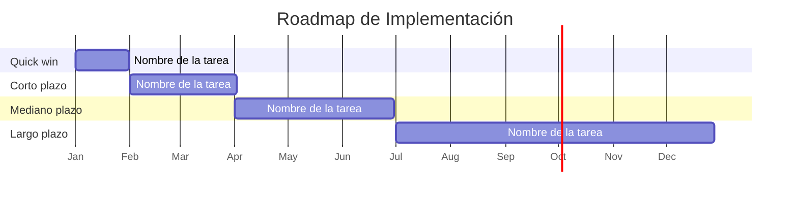

# 📄 Plan de Implementación (Roadmap de Transición)

## 🔖 Cliente
_Escriba aquí el nombre del cliente real al que se le aplicó el análisis arquitectónico._

## 👥 Integrantes del equipo
- Nombre 1 (correo o usuario GitHub)
- Nombre 2
- Nombre 3

## 🎯 Propósito de este documento

Explique en 2-3 líneas qué solución arquitectónica se va a implementar (Acto 3 de la presentación) y por qué el cliente necesita un plan de implementación además del diseño — es decir, qué pasaría si solo se entregara el diseño sin una ruta clara de ejecución.

## 🗺️ Fases de implementación

Traduzca la solución en fases ejecutables. Cada fase debe estar trazada a un riesgo o brecha específico identificado en los Talleres 4 (Infraestructura), 5 (STRIDE) o 6 (Normatividad) — no invente fases sin relación con hallazgos previos del curso.

| Fase | Qué se implementa | Riesgo / brecha que corrige | Esfuerzo (Bajo/Medio/Alto) | Duración estimada | Responsable sugerido |
|---|---|---|---|---|---|
| Quick win | | | | | |
| Corto plazo | | | | | |
| Mediano plazo | | | | | |
| Largo plazo | | | | | |

> **Recuerde:** el orden de las fases no depende solo de la prioridad de riesgo (Taller 8, Paso 3) — un riesgo de alta prioridad pero de alto esfuerzo no necesariamente va primero. Cruce prioridad de riesgo con esfuerzo de implementación al secuenciar.

## 📅 Línea de tiempo

Represente la línea de tiempo de las fases anteriores. Puede usar un diagrama de Gantt en Mermaid (se renderiza solo en GitHub) o una tabla/imagen equivalente:

## 🔁 Dependencias entre fases

Indique si alguna fase requiere que otra termine primero (ej. "la sincronización en tiempo real depende de que el proveedor de nube confirme la capacidad adicional del Paso 2").

## 📚 Referencias

Cite aquí cualquier fuente sobre gestión de portafolios de proyectos, priorización o buenas prácticas de transición arquitectónica (ej. TOGAF ADM Fase E/F - Opportunities & Solutions / Migration Planning) que haya usado para construir este plan.

---

_Este documento hace parte de la entrega final del Taller 9 del curso AREM (Arquitectura Empresarial) - Universidad de La Sabana._
